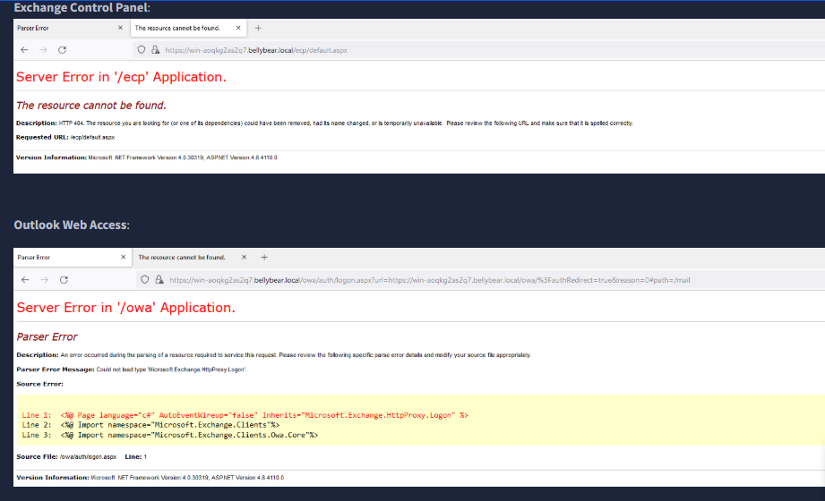
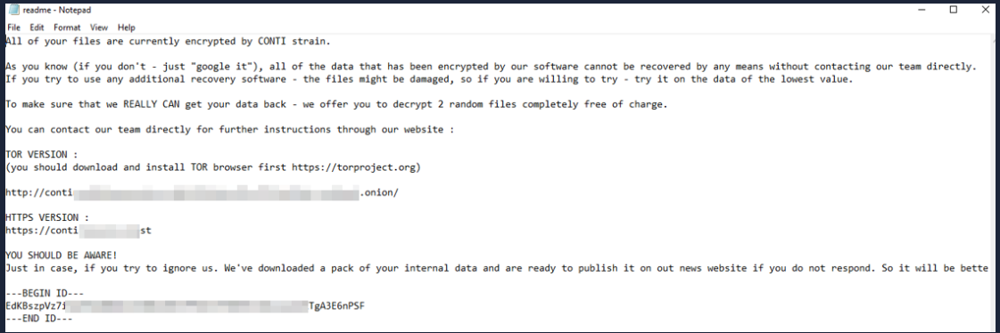
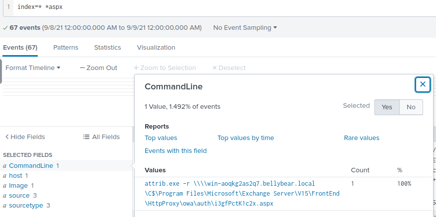
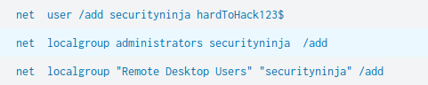
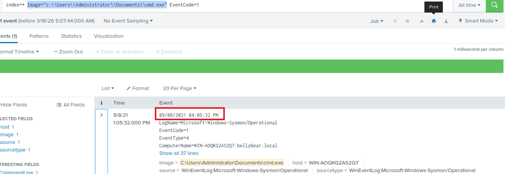
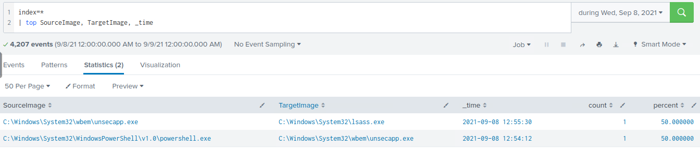
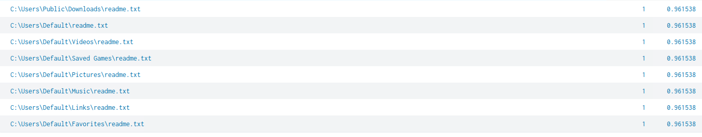

# Ransomware Incident Investigation Report
## TryHackMe – Conti Ransomware (Exchange Compromise)

## Analyst
SOC Analyst Trainee

---

# 1. Incident Overview

Multiple employees reported inability to access Outlook services, and the Exchange Administrator was unable to access the Exchange Admin Center.

Initial triage revealed ransom notes across the Exchange server, indicating a ransomware infection.

The objective of this investigation was to determine how the attacker gained access, escalated privileges, and deployed ransomware.

---

# 2. Impact Evidence

Users experienced service disruption when attempting to access Outlook.

### Evidence

Ransom notes were found across the system, confirming ransomware activity.

### Evidence

---

# 3. Initial Access – Web Shell

Investigation revealed that the attacker gained access through a **web shell** deployed on the Exchange server.

Timestamp:
03:52:09 PM

Identified web shell:

C:\Program Files\Microsoft\Exchange Server\V15\FrontEnd\HttpProxy\owa\auth\i3gFcfK1c2.aspx

This indicates exploitation of a vulnerable web-facing Exchange service.

### Evidence

---

# 4. Web Shell Execution

The web shell was actively used to execute commands on the system.

Observed command:

attirib.exe -w \\127.0.0.1\c$\Program Files\Microsoft\Exchange Server\V15\FrontEnd\HttpProxy\owa\auth\i3gFcfK1c2.aspx

This confirms that the attacker leveraged the web shell for remote command execution.

---

# 5. Persistence and Privilege Escalation

After gaining access, the attacker created a new user account.

Timestamp:
04:04:10 PM

Command used:

net user /add securityninja hardToHack123$

The user was then added to:

- Administrators group  
- Remote Desktop Users group  

This ensured persistent privileged access.

### Evidence

---

# 6. Malicious Execution

A suspicious executable was identified:

C:\Users\Administrator\Documents\cmd.exe

Timestamp:
04:05:32 PM

This location is abnormal for `cmd.exe`, indicating it is a malicious or renamed binary.

Hash:

MD5: 290C7DFB01E50CEA9E19DA81A781AF2C

### Evidence

---

# 7. Credential Access

Analysis revealed interaction with:

C:\Windows\System32\lsass.exe

This strongly suggests credential dumping activity, as LSASS stores authentication data.

---

# 8. Process Injection / Migration

Suspicious process behavior was observed:

Source:
C:\Windows\System32\WindowsPowerShell\v1.0\powershell.exe  

Target:
C:\Windows\System32\wbem\unsecapp.exe  

Timestamp:
2021-09-08 12:54:12

This indicates process injection or migration for stealth and persistence.

### Evidence

---

# 9. Ransomware Deployment

File creation events (EventCode 11) revealed that:

readme.txt

was written across multiple directories.

This file contains the ransomware note.

Note: The file itself is not malicious, but confirms ransomware deployment.

### Evidence

---

# 10. Attack Timeline

- 03:52:09 PM  
  Initial access via Exchange web shell deployment  

- 04:04:10 PM  
  New user account created and added to privileged groups  

- 04:05:32 PM  
  Execution of malicious binary (cmd.exe in non-standard location)  

- Post-exploitation  
  Credential dumping, process injection, and ransomware deployment  

---

# 11. Indicators of Compromise (IOCs)

### Files

C:\Users\Administrator\Documents\cmd.exe  
C:\Program Files\Microsoft\Exchange Server\V15\FrontEnd\HttpProxy\owa\auth\i3gFcfK1c2.aspx  
readme.txt (multiple locations)  

---

### Hash

MD5: 290C7DFB01E50CEA9E19DA81A781AF2C  

---

### Processes

powershell.exe  
unsecapp.exe  
lsass.exe  

---

# 12. Identified Vulnerabilities (Challenge Validation)

Based on challenge findings:

- CVE-2020-0796 – SMBv3 Remote Code Execution vulnerability  
- CVE-2018-13374 – Fortinet path traversal vulnerability  
- CVE-2018-13379 – Fortinet SSL VPN credential disclosure  

These vulnerabilities are commonly leveraged for initial access or credential harvesting in real-world attacks.

---

# 13. Root Cause

The compromise originated from exploitation of a vulnerable Exchange service, allowing the attacker to deploy a web shell.

The attacker then established persistence, escalated privileges, accessed credentials, and deployed ransomware.

---

# 14. Recommendations

- Patch Exchange and external-facing services
- Monitor for web shell activity
- Detect execution from non-standard directories
- Monitor account creation and privilege escalation
- Detect LSASS access attempts
- Monitor PowerShell activity
- Implement endpoint detection and response (EDR)

---

# 15. Conclusion

The Exchange server was compromised through web shell deployment, followed by privilege escalation and credential harvesting.

The attacker successfully deployed ransomware, causing service disruption.

This incident demonstrates how attackers chain multiple techniques to achieve full system compromise.
