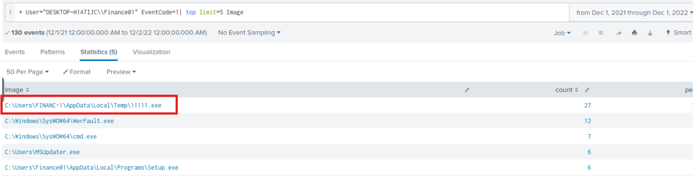
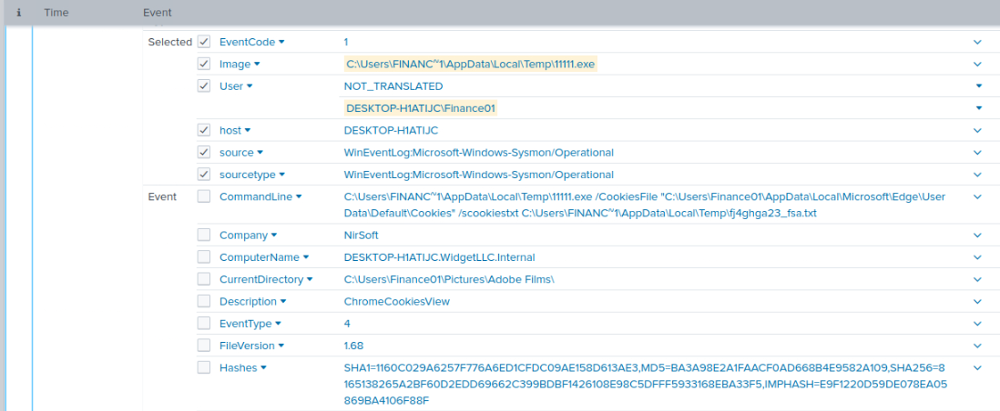
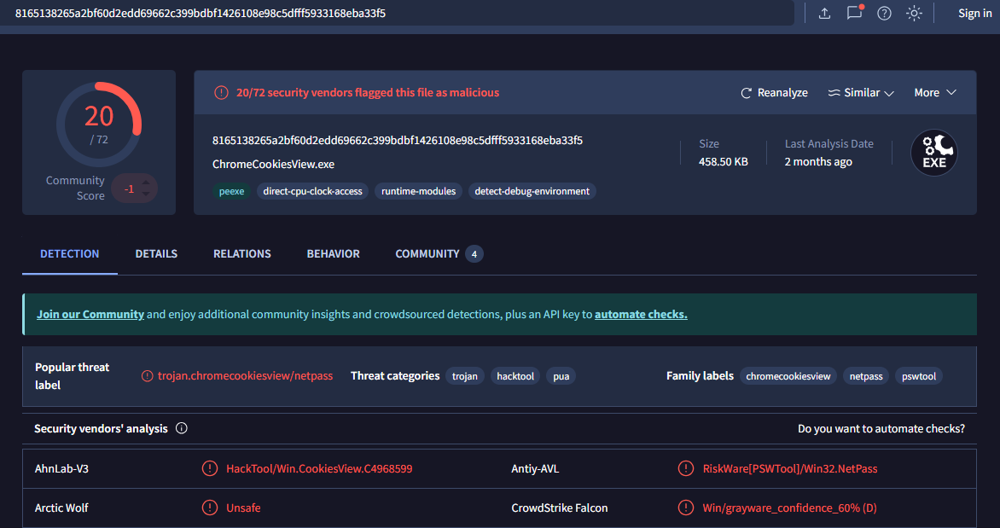
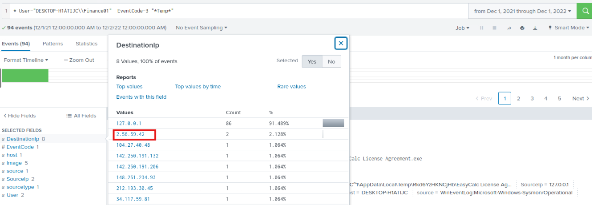
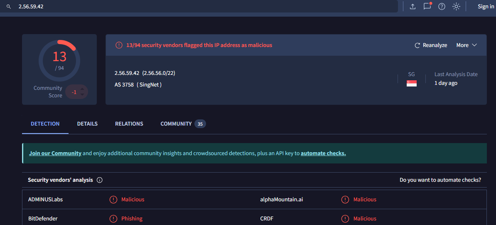
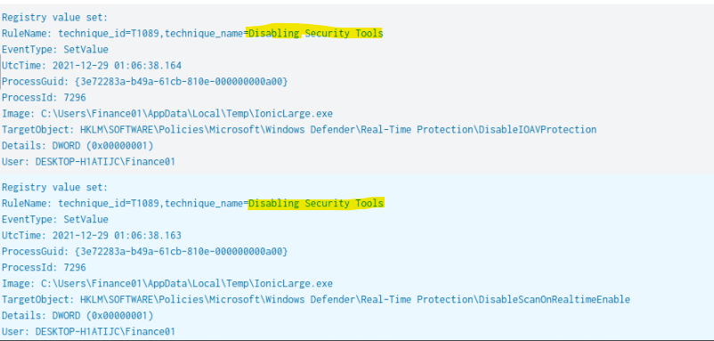
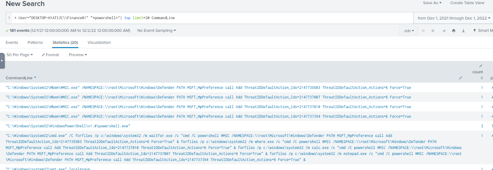

# Endpoint Compromise Investigation
## TryHackMe – New Hire Old Artifacts

## Analyst
SOC Analyst – TryNotHackMe MSSP

---

# 1. Incident Overview

Widget LLC recently onboarded their endpoints into the TryNotHackMe managed Splunk environment. During onboarding, the customer reported a concerning period in **December 2021** where endpoint security protections were disabled on a workstation belonging to a **Finance Department employee**.

The objective of this investigation was to review endpoint telemetry within Splunk to determine whether malicious activity occurred during that time period.

---

# 2. Investigation Methodology

The investigation focused on analyzing the following telemetry sources within Splunk:

- Process creation events (EventCode 1)
- Network connection events (EventCode 3)
- Registry modification activity
- PowerShell command execution logs

The goal was to identify suspicious processes, command-and-control communication, and attempts to disable or bypass security mechanisms.

---

# 3. Suspicious Process Execution

During analysis of **process creation logs (EventCode 1)**, a suspicious executable was identified executing from the Windows temporary directory.

Full path of the executable:

C:\Users\FINANC~1\AppData\Local\Temp\11111.exe

Execution of binaries from temporary directories is frequently associated with malware droppers or staged payload execution.

### Evidence

---

# 4. Malware Verification

Hash values extracted from the process creation event were submitted to **VirusTotal** for reputation analysis.

VirusTotal results indicated that the executable was **detected as malicious by multiple security vendors**, confirming that the file is malware.

### Evidence

---

# 5. Suspicious Network Activity

Following identification of the malicious binary, the investigation pivoted to **network connection logs (EventCode 3)** in order to determine whether the executable communicated with external infrastructure.

Filtering connections originating from the same directory revealed outbound communication with the following destination IP address:

2.56.59.42

This connection strongly suggests command-and-control communication with attacker infrastructure.

### Evidence

---

# 6. IP Reputation Analysis

The suspicious IP address was investigated using threat intelligence sources.

Results confirmed that the IP address has been associated with malicious activity and is likely part of attacker-controlled infrastructure.

### Evidence

---

# 7. Registry Modifications

Further investigation revealed several suspicious registry modifications performed on the infected host.

These modifications targeted Windows Defender policy settings located at the following registry key:

HKLM\SOFTWARE\Policies\Microsoft\Windows Defender

Such changes indicate that the attacker attempted to disable or weaken endpoint protection mechanisms in order to avoid detection.

### Evidence

---

# 8. PowerShell Activity

Analysis of PowerShell execution logs revealed that the attacker used **WMIC and PowerShell commands** to modify Windows Defender configuration.

Example command observed during the investigation:

powershell WMIC /NAMESPACE:\\root\Microsoft\Windows\Defender PATH MSFT_MpPreference call Add ThreatIDDefaultAction_Ids=2147735503 ThreatIDDefaultAction_Actions=6 Force=True

These commands altered the default action Windows Defender should take when detecting specific threat IDs, effectively weakening the system's defensive capabilities.

### Evidence

---

# 9. Timeline of Events

Initial Stage  
Suspicious executable `11111.exe` executed from the user's temporary directory.

Command and Control  
The executable established an outbound network connection to IP address `2.56.59.42`.

Defense Evasion  
Multiple registry modifications were made affecting Windows Defender policies.

Security Modification  
PowerShell and WMIC commands were executed to modify Defender threat-handling behavior.

---

# 10. Indicators of Compromise (IOCs)

Malicious Executable  
C:\Users\FINANC~1\AppData\Local\Temp\11111.exe

Additional Suspicious Binaries  
IonicLarge.exe  
PalitExplorer.exe  

Malicious IP Address  
2.56.59.42

Registry Key Modified  
HKLM\SOFTWARE\Policies\Microsoft\Windows Defender

---

# 11. Root Cause

The compromise originated from the execution of the malicious binary `11111.exe` located in the user's temporary directory. Once executed, the malware established communication with an external command-and-control server and proceeded to modify Windows Defender policies in order to evade detection.

---

# 12. Recommendations

- Block outbound communication to the malicious IP address `2.56.59.42`
- Monitor and alert on execution of binaries from temporary directories
- Implement detection rules for suspicious WMIC and PowerShell commands targeting Windows Defender
- Audit and monitor changes to Windows Defender registry policies
- Strengthen endpoint protection monitoring across Finance Department systems

---

# 13. Conclusion

The investigation confirms that the Finance Department workstation experienced malicious activity during the time period when endpoint security protections were disabled. Evidence indicates execution of malware, communication with external attacker infrastructure, and modification of security controls to evade detection.

Immediate remediation and improved monitoring are recommended to prevent similar incidents in the future.
